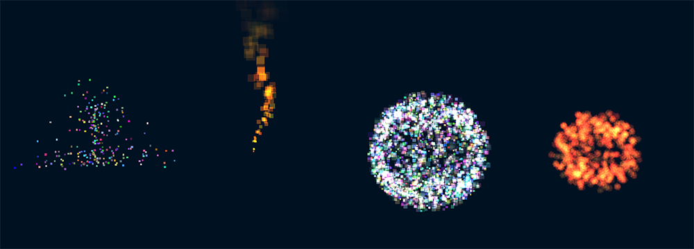

# Partykals

Particles system library for THREE.js with a really lame name!

Live demo can be found [here](https://ronenness.github.io/partykals/demo/index.html).


## Why

THREE.js provides just the basics to create particles system, but it requires a lot of work to actually have working particles. This is what this library is for.

There are many alternatives and more robust particle systems for THREE.js out there, but at the time of writing these lines (15/12/2019) none of the ones I found works with latest THREE version (r111).

# Usage

To create a new particles system:

```js
var system = new Partykals.ParticlesSystem({
        container: scene, // <-- THREE.JS object to attach system to.
        particles: {
            // particles options, will be described later..
        },
        system: {
            // system options, will be described later..
            emitters: // emitter(s), will be described later
        }
    });
```

And then to update system, you need to call `update()` every frame:

```js
system.update();
```

## Quick Example

Now lets take a look at a short working example:

```js
// scene and renderer are assumed to be created here..

// create  particles system:
var system = new Partykals.ParticlesSystem({
    container: scene,
    particles: {
        globalSize: 5,
        ttl: 10,
        velocity: new Partykals.Randomizers.SphereRandomizer(12.5),
        velocityBonus: new THREE.Vector3(0, 25, 0),
        gravity: -10,
        startColor: new Partykals.Randomizers.ColorsRandomizer(),
        endColor: new Partykals.Randomizers.ColorsRandomizer(),
    },
    system: {
        particlesCount: 1000,
        emitters: new Partykals.Emitter({
            onInterval: new Partykals.Randomizers.MinMaxRandomizer(0, 5),
            interval: new Partykals.Randomizers.MinMaxRandomizer(0, 0.25),
        }),
        speed: 1,
    }
});

// update loop
function animate() {

    requestAnimationFrame( animate );
    system.update();
    renderer.render( scene, camera );

}
```

For more info, check out the demo in the `demo/` folder.

## Particles Options

Particles options are all the settings related to the particles themselves.
Options are (pasted from code):

```js
/*
* // PARTICLES OPTIONS
* ============================================================================
* @param {*} options.particles Particle-related options.
* 
* // PARTICLES TTL
* @param {Number} options.particles.ttl How long, in seconds, every particle lives.
* @param {Number} options.particles.ttlExtra If provided, will add random numbers from 0 to ttlExtra to particle's ttl.
* 
* // PARTICLES FADING / ALPHA
* @param {Boolean} options.particles.alpha Per-particle constant alpha; either a constant value (Number) or a Partykals.Randomizers.Randomizer instance to create random values.
* @param {Number} options.particles.startAlpha Particles starting opacity; either a constant value (Number) or a Partykals.Randomizers.Randomizer instance to create random values.
* @param {Number} options.particles.endAlpha Particles ending opacity; either a constant value (Number) or a Partykals.Randomizers.Randomizer instance to create random values.
* 
* // PARTICLES GROWING / SIZE
* @param {Number} options.particles.size Per-particle constant size; either a constant value (Number) or a Partykals.Randomizers.Randomizer instance to create random values.
* @param {Number} options.particles.startSize Particles starting size; either a constant value (Number) or a Partykals.Randomizers.Randomizer instance to create random values.
* @param {Number} options.particles.endSize Particles ending size; either a constant value (Number) or a Partykals.Randomizers.Randomizer instance to create random values.
* 
* // PARTICLES COLORING
* @param {THREE.Color} options.particles.color Per-particle constant color; either a constant value (THREE.Color) or a Partykals.Randomizers.Randomizer instance to create random values.
* @param {THREE.Color} options.particles.startColor Starting color min value; either a constant value (THREE.Color) or a Partykals.Randomizers.Randomizer instance to create random values.
* @param {THREE.Color} options.particles.endColor Ending color min value; either a constant value (THREE.Color) or a Partykals.Randomizers.Randomizer instance to create random values.
* 
* // PARTICLES ACCELERATION 
* @param {THREE.Vector3} options.particles.acceleration Particles acceleration; either a constant value (THREE.Vector3) or a Partykals.Randomizers.Randomizer instance to create random values.
* @param {Number} options.particles.gravity Gravity force affecting the particles.    
* 
* // PARTICLES ROTATION
* @param {Number} options.particles.rotation Per-particle rotation (only works with texture); either a constant value (Number) or a Partykals.Randomizers.Randomizer instance to create random values.
* @param {Number} options.particles.rotationSpeed Particles rotation speed (only works with texture); either a constant value (Number) or a Partykals.Randomizers.Randomizer instance to create random values.
* 
* // PARTICLES VELOCITY 
* @param {*} options.particles.velocity Particles starting velocity; either a constant value (THREE.Vector3) or a Partykals.Randomizers.Randomizer instance to create random values.
* @param {THREE.Vector3} options.particles.velocityBonus Velocity value to add to all particles after randomizing velocity.
* 
* // PARTICLES OFFSET
* @param {THREE.Vector3} options.particles.offset Particles offset from system's center; either a constant value (THREE.Vector3) or a Partykals.Randomizers.Randomizer instance to create random values.
* 
* // PARTICLE GLOBALS
* @param {Boolean} options.particles.worldPosition If true, particles will maintain their world position after spawn even if the system moves.
* @param {Number} options.particles.globalSize Const size for all particles. Note: this is more efficient than setting per-particle size property.
* @param {Number} options.particles.globalColor Global color to affect all particles. Note: this is more efficient than setting per-particle color property.
* @param {String} options.particles.blending Particles blending mode (opaque / blend / additive).
* @param {THREE.Texture} options.particles.texture Particle's texture to use.
* 
* // CUSTOM CALLBACKS
* @param {Function} options.particles.onUpdate Optional method to call per-particle every update frame.
* @param {Function} options.particles.onSpawn Optional method to call per-particle every time a particle spawns (after everything is set).
*  */
```

## System Options

The system options are options related to the system itself or the material used.
Options are (pasted from code):

```js
/*
* // SYSTEM OPTIONS
* ============================================================================
* @param {*} options.system System-related options.
* @param {Number} options.system.particlesCount Particles count.
* @param {Number} options.system.ttl How long, in seconds, the particle system lives.
* @param {Number} options.system.speed Speed factor to affect all particles and emitting. Note: the only thing this don't affect is system's ttl.
* @param {Function} options.system.onUpdate Optional method to call every update frame.
* @param {Partykals.Emitter} options.system.emitters A single emitter or a list of emitters to attach to this system.
* @param {Boolean} options.system.perspective If true, will scale particles based on distance from camera.
* @param {Number} options.system.scale Overall system scale when in perspective mode (if perspective=false, will be ignored). A good value is between 400 and 600.
* @param {Boolean} options.system.depthWrite Should we perform depth write? (default to true).
* @param {Boolean} options.system.depthTest Should we perform depth test? (default to true).
*/
```

## Emitters

Emitters are objects that determine the rate of generating new particles. As you can see above, when creating the particles system you need to provide an emitter (or list of emitters). You can also attach emitters after creation with `system.addEmitter(emitter)`.

To create a new emitter:

```js
var emitter = new Partykals.Emitter(options);
```

Emitter options are (paste from code):

```js
/*
* @param {*} options Emitter options.
* @param {*} options.onSpawnBurst Burst of particles when particle system starts; either a constant value (Number) or a Partykals.Randomizers.Randomizer instance to create random numbers.
* @param {*} options.onInterval Burst of particles every interval; either a constant value (Number) or a Partykals.Randomizers.Randomizer instance to create random numbers.
* @param {Number} options.interval Spawn interval time, in seconds; either a constant value (Number) or a Partykals.Randomizers.Randomizer instance to create random numbers.
* @param {Number} options.detoretingMinTtl If provided and particle system's ttl is below this value, will start emitting less and less until stopping completely.
*/
```

## Randomizers

Randomizers are classes that generate random numbers, vectors, colors and more. We use them, as guessed, to generate randomness in our particles system (most particles-level options can either be a constant value, or a randomizer, to get random per-particle value).

For more info, check out the randomizers under `randomizers/` folder, or under `Partykals.Randomizers` namespace.

## License

`Partykals` is released under the permissive MIT license and is absolutely free for any (legal) purpose, commerical included.
